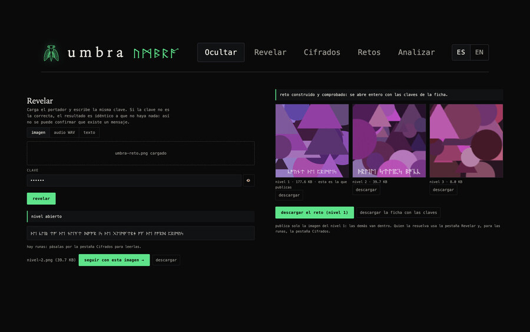

# Kisnner Obando

**Ingeniero de software** · Managua, Nicaragua
**Software engineer** · Managua, Nicaragua

Estudio Ingeniería en Sistemas de Información Computacionales en la UAM. Construyo apps nativas para macOS, iOS y watchOS, backend transaccional y herramientas web, y contribuyo a open source.
I study Computer Information Systems Engineering at UAM. I build native apps for macOS, iOS and watchOS, transactional backends and web tools, and contribute to open source.

**Portafolio / Portfolio:** [kisnner26.github.io](https://kisnner26.github.io)

## Proyectos destacados · Featured work

### Apps nativas de Apple · Native Apple apps

- [**girasol**](https://github.com/kisnner26/girasol) — salud en el Apple Watch: UV, agua, calorías, sueño y juegos de muñeca. Gratis y de código abierto. / A free, open-source health app for Apple Watch. SwiftUI.
- [**uam-class**](https://github.com/kisnner26/uam-class) — app nativa de macOS para el portal de la UAM (Moodle), con token en Keychain, exámenes nativos y multicuenta. / A native macOS client for UAM's Moodle portal.
- [**clavis**](https://github.com/kisnner26/clavis) — tu muñeca es la llave: llavero aprobado con el Apple Watch, con hub en el Mac y extensión de Chrome. / Approve your keychain from your Apple Watch.
- [**sonda**](https://github.com/kisnner26/sonda) — herramientas de radio, red y sensores para el iPhone. / Radio, network and sensor toolbox for iPhone.
- [**lidless**](https://github.com/kisnner26/lidless) — app de barra de menú que mantiene el Mac despierto con la tapa cerrada solo mientras Claude Code trabaja. / Menu bar app that keeps a MacBook awake only while Claude Code is working.

### Web y sistemas · Web and systems

- [**umbra**](https://github.com/kisnner26/umbra) — laboratorio de esteganografía en el navegador: imágenes, audio y texto, con cifrado y retos encadenados. / A browser steganography lab. [demo](https://kisnner26.github.io/umbra/)

  

- [**wc26-studio**](https://github.com/kisnner26/wc26-studio) — simulador del Mundial 2026 con Monte Carlo y modelo estadístico multifactor. / World Cup 2026 Monte Carlo simulator. [demo](https://kisnner26.github.io/wc26-studio/)
- [**2-player-web**](https://github.com/kisnner26/2-player-web) — 500 minijuegos para dos en un mismo teclado, sin servidor ni cuentas. / 500 two-player minigames on one keyboard, no server. [demo](https://kisnner26.github.io/2-player-web/)
- [**aula-abierta**](https://github.com/kisnner26/aula-abierta) — plataforma open source para academias de idiomas (Laravel + React). / Open-source platform for language academies.
- [**tiktok-gesture-scroll**](https://github.com/kisnner26/tiktok-gesture-scroll) — extensión de Chrome, Edge y Brave: pasa de video con un gesto de la mano frente a la webcam; todo corre en tu equipo. / Hand-gesture scrolling, fully local.

## Open source

- [radare2](https://github.com/radareorg/radare2/pull/26745) — 2 PRs mergeados / 2 merged PRs
- [swift-nio](https://github.com/apple/swift-nio/pull/3744), [swift-nio-extras](https://github.com/apple/swift-nio-extras/pull/327), [swift-argument-parser](https://github.com/apple/swift-argument-parser/pull/972) — PRs abiertos / open PRs

## Contacto · Contact

[LinkedIn](https://www.linkedin.com/in/kisnner-obando-16014029b/) · kisnnerobando7@gmail.com
