

  

  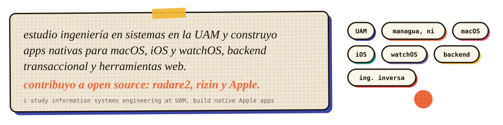

  

  
  <a href="https://github.com/kisnner26/inventario-saas">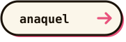</a>
  <a href="https://github.com/kisnner26/claude-pet">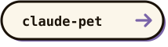</a>
  
  <a href="https://github.com/kisnner26/2-player-web">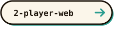</a>

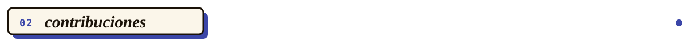

  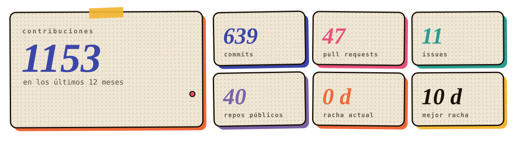
  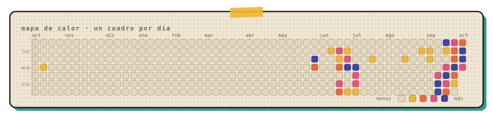
  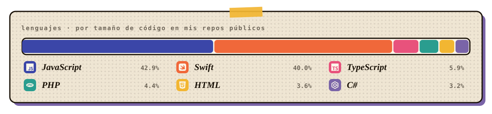

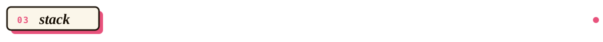

  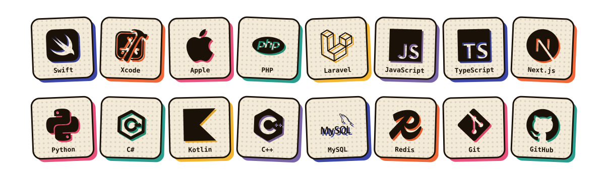
  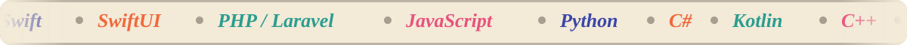

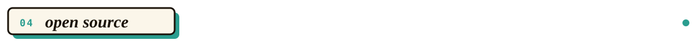

  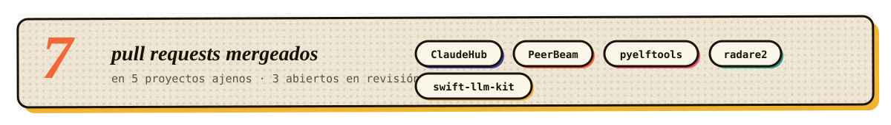

  <a href="https://github.com/radareorg/radare2/pulls?q=is%3Apr+author%3Akisnner26">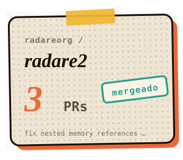</a>
  <a href="https://github.com/rizinorg/rizin/pulls?q=is%3Apr+author%3Akisnner26">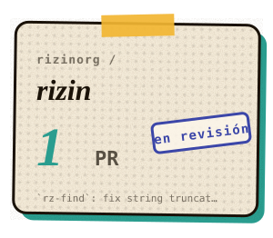</a>
  <a href="https://github.com/apple/swift-nio/pulls?q=is%3Apr+author%3Akisnner26">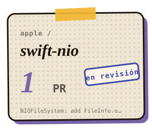</a>
  <a href="https://github.com/apple/swift-argument-parser/pulls?q=is%3Apr+author%3Akisnner26">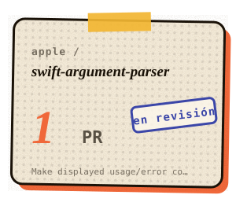</a>

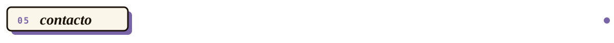

  
  
  
  

  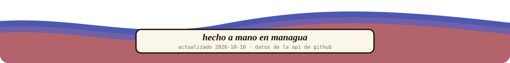

