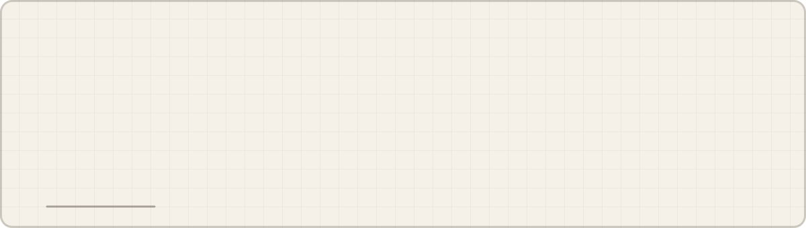
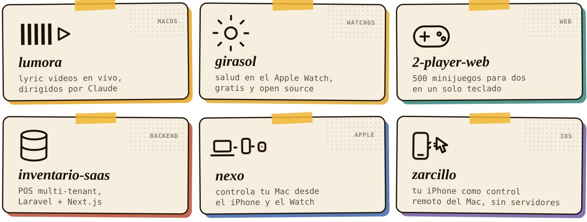

  

estudio ingeniería en sistemas en la UAM y construyo apps nativas para macOS, iOS y watchOS, backend transaccional y herramientas web. contribuyo a open source: radare2, rizin y Apple.
 i study information systems engineering at UAM, build native Apple apps and transactional backends, and contribute to open source.

  

  <a href="https://github.com/kisnner26/lumora">lumora</a> ·
  <a href="https://github.com/kisnner26/girasol">girasol</a> ·
  <a href="https://github.com/kisnner26/clavis">clavis</a> ·
  <a href="https://github.com/kisnner26/uam-class">uam-class</a> ·
  <a href="https://github.com/kisnner26/inventario-saas">inventario-saas</a> ·
  <a href="https://kisnner26.github.io/umbra/">umbra</a>

**más** — [todos los proyectos](https://kisnner26.github.io) · [writeups de depuración](https://kisnner26.github.io/#writeups) (Sidecar -203, AltServer, emparejado del Watch)
**open source** — [radare2](https://github.com/radareorg/radare2/pulls?q=is%3Apr+author%3Akisnner26) (2 PRs mergeados) · [rizin](https://github.com/rizinorg/rizin/pull/6782) · [swift-nio](https://github.com/apple/swift-nio/pull/3744) · [swift-argument-parser](https://github.com/apple/swift-argument-parser/pull/972)
**stack** — Swift · SwiftUI · PHP/Laravel · JavaScript · Python · C# · Kotlin · C++

[portafolio](https://kisnner26.github.io) · [LinkedIn](https://www.linkedin.com/in/kisnner-obando-16014029b/) · kisnnerobando7@gmail.com
